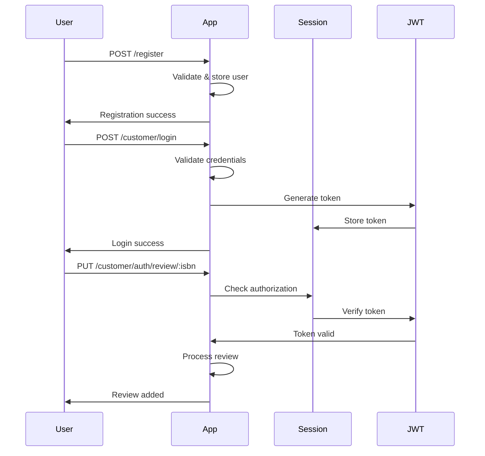

# Book Review Application - Authentication Implementation

## Overview

This document provides a comprehensive guide to the authentication mechanism implementation for the Book Review Application. The application is built using Express.js with JWT-based session authentication, allowing users to register, login, and manage book reviews securely.

## 🔧 Technical Architecture

### Core Technologies
- **Express.js**: Web application framework
- **JSON Web Tokens (JWT)**: For secure authentication
- **Express Session**: Session management middleware
- **Node.js**: Runtime environment

### Project Structure
```
final_project/
├── index.js              # Main server file with authentication middleware
├── package.json           # Project dependencies and scripts
├── router/
│   ├── auth_users.js     # Protected routes requiring authentication
│   ├── general.js        # Public routes (registration, book browsing)
│   └── booksdb.js        # In-memory books database
└── README.md             # This documentation
```

## 🔐 Authentication Mechanism

### 1. Session-Based JWT Authentication

The application implements a hybrid approach combining Express sessions with JWT tokens:

#### **Session Configuration** (`index.js`)
```javascript
app.use("/customer", session({
    secret: "fingerprint_customer",  // Secret for signing session cookies
    resave: true,                   // Save session even if not modified
    saveUninitialized: true         // Save new sessions
}));
```

#### **Authentication Middleware** (`index.js`)
The middleware protects all routes under `/customer/auth/*`:

```javascript
app.use("/customer/auth/*", function auth(req, res, next) {
    if(req.session.authorization) {
        let token = req.session.authorization['accessToken'];
        jwt.verify(token, "access", (err, user) => {
            if (!err) {
                req.user = user;  // Attach user info to request
                next();           // Proceed to route handler
            } else {
                return res.status(403).json({message: "User not authenticated"});
            }
        });
    } else {
        return res.status(403).json({message: "User not logged in"});
    }
});
```

### 2. User Management System

#### **Data Storage** (`auth_users.js`)
- Users are stored in an in-memory array
- In production, this should be replaced with a database
- Structure: `{ username: string, password: string }`

#### **Validation Functions**
```javascript
// Check if username exists
const isValid = (username) => {
    let userswithsamename = users.filter((user) => user.username === username);
    return userswithsamename.length > 0;
}

// Authenticate user credentials
const authenticatedUser = (username, password) => {
    let validusers = users.filter((user) => 
        user.username === username && user.password === password);
    return validusers.length > 0;
}
```

## 📡 API Endpoints

### Public Routes (No Authentication Required)

#### 1. **User Registration**
- **Endpoint**: `POST /register`
- **Purpose**: Create a new user account
- **Request Body**:
  ```json
  {
    "username": "string",
    "password": "string"
  }
  ```
- **Responses**:
  - `200`: User registered successfully
  - `400`: Missing username/password
  - `409`: Username already exists

#### 2. **Get All Books**
- **Endpoint**: `GET /`
- **Purpose**: Retrieve all available books
- **Response**: Complete books catalog with reviews

#### 3. **Get Book by ISBN**
- **Endpoint**: `GET /isbn/:isbn`
- **Purpose**: Get specific book details
- **URL Parameter**: `isbn` - Book's ISBN number

#### 4. **Get Books by Author**
- **Endpoint**: `GET /author/:author`
- **Purpose**: Find all books by a specific author
- **URL Parameter**: `author` - Author's name (case-sensitive)

#### 5. **Get Books by Title**
- **Endpoint**: `GET /title/:title`
- **Purpose**: Find books with specific title
- **URL Parameter**: `title` - Book title (case-sensitive)

#### 6. **Get Book Reviews**
- **Endpoint**: `GET /review/:isbn`
- **Purpose**: Retrieve all reviews for a specific book
- **URL Parameter**: `isbn` - Book's ISBN number

### Protected Routes (Authentication Required)

#### 1. **User Login**
- **Endpoint**: `POST /customer/login`
- **Purpose**: Authenticate user and create session
- **Request Body**:
  ```json
  {
    "username": "string",
    "password": "string"
  }
  ```
- **Success Response**: JWT token stored in session
- **Authentication Flow**:
  1. Validate credentials using `authenticatedUser()`
  2. Generate JWT token with 1-hour expiration
  3. Store token in `req.session.authorization`

#### 2. **Add/Modify Book Review**
- **Endpoint**: `PUT /customer/auth/review/:isbn`
- **Purpose**: Add or update a book review
- **URL Parameter**: `isbn` - Book's ISBN number
- **Query Parameter**: `review` - Review text content
- **Features**:
  - One review per user per book
  - Updating existing review overwrites previous one
  - Username automatically attached from session

#### 3. **Delete Book Review**
- **Endpoint**: `DELETE /customer/auth/review/:isbn`
- **Purpose**: Delete user's own review
- **URL Parameter**: `isbn` - Book's ISBN number
- **Security**: Users can only delete their own reviews

## 🔄 Authentication Flow

### Registration → Login → Protected Actions



## 🚀 Getting Started

### 1. Installation
```bash
cd expressBookReviews/final_project
npm install
```

### 2. Start Server
```bash
node index.js
# Output: Server is running on port 5000
```

### 3. Test Registration
```bash
curl -X POST http://localhost:5000/register \
  -H "Content-Type: application/json" \
  -d '{"username":"testuser","password":"testpass"}'
```

### 4. Test Login
```bash
curl -X POST http://localhost:5000/customer/login \
  -H "Content-Type: application/json" \
  -d '{"username":"testuser","password":"testpass"}' \
  -c cookies.txt
```

### 5. Test Protected Route
```bash
curl -X PUT "http://localhost:5000/customer/auth/review/1?review=Great book!" \
  -H "Content-Type: application/json" \
  -b cookies.txt
```

## 🔒 Security Features

### 1. **JWT Token Security**
- Tokens expire after 1 hour
- Signed with secret key ("access")
- Stored in secure session cookies

### 2. **Session Management**
- Sessions tied to specific user credentials
- Automatic cleanup on logout/expiration
- Secure cookie configuration

### 3. **Route Protection**
- Middleware validates all protected routes
- Automatic rejection of unauthenticated requests
- User context attached to request object

### 4. **Input Validation**
- Username/password requirement checks
- Duplicate username prevention
- Review content validation

## 📊 Data Structure

### Books Database Structure
```javascript
{
  "1": {
    "author": "Chinua Achebe",
    "title": "Things Fall Apart",
    "reviews": {
      "username1": "Great book!",
      "username2": "Excellent story"
    }
  }
}
```

### User Storage Structure
```javascript
[
  {
    "username": "john_doe",
    "password": "securepassword"
  }
]
```

### Session Authorization Structure
```javascript
req.session.authorization = {
  accessToken: "jwt_token_here",
  username: "john_doe"
}
```

## 🧪 Testing Scenarios

### 1. **Authentication Tests**
- ✅ Register new user
- ✅ Login with valid credentials
- ❌ Login with invalid credentials
- ❌ Access protected route without login

### 2. **Review Management Tests**
- ✅ Add new review (authenticated user)
- ✅ Modify existing review (same user)
- ✅ Delete own review
- ❌ Access review endpoints without authentication

### 3. **Public Endpoint Tests**
- ✅ Get all books
- ✅ Search by ISBN, author, title
- ✅ View book reviews

## 🚨 Security Considerations

### Production Recommendations

1. **Environment Variables**
   ```javascript
   secret: process.env.SESSION_SECRET,
   jwt.sign(data, process.env.JWT_SECRET)
   ```

2. **Database Integration**
   - Replace in-memory storage with proper database
   - Implement password hashing (bcrypt)
   - Add input sanitization

3. **HTTPS Enforcement**
   - Secure cookie configuration
   - SSL/TLS certificate implementation

4. **Rate Limiting**
   - Implement login attempt limits
   - API rate limiting middleware

5. **Error Handling**
   - Comprehensive error logging
   - User-friendly error messages
   - Security headers implementation

## 🎯 Conclusion

The authentication mechanism is now fully implemented with:
- ✅ JWT-based session authentication
- ✅ User registration and login
- ✅ Protected route middleware
- ✅ Review management system
- ✅ Comprehensive error handling
- ✅ Detailed documentation and comments

The application is ready for testing and can be extended with additional features as needed.

---
*Last Updated: July 28, 2025*
*Book Review Application v1.0.0*
